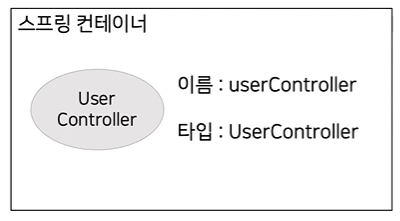

# UserController와 스프링 컨테이너
- UserController의문점
```Java
public UserController(JdbcTemplate jdbcTemplate){
    this.userService = new UserService(jdbcTemplate);
}
```
1. UserController에서  
누가 UserController를 인스턴스화 하고있는가?
2. 생성자를 호출하는과정에서 JdbcTemplate에 의존하고있다.  
그러나 JdbcTemplate이란 클래스를 설정해준적이 없다.
어떻게 가져올수있었을까?

# 의문점 해결
1. @RestController 어노테이션 덕분이다.
> UserController를 스프링 빈으로 등록시킨다.
## 스프링 빈이란?
1. 서버가 시작되면, 스프링 서버 내부에 거대한 컨테이너를 만들게 된다. 컨테이너 안에는 클래스가 들어가고, 다양한 정보도 같이 들어가고 인스턴스화가 된다. 


2. JdbcTemplate또한 스프링 빈으로 등록되어있어서 가져올수있었다. 그러나 누가 이걸 스프링빈으로 등록해줫을까?
> 우리가 가져온 Dependency가 등록해주고 있었다. 
```Java
dependencies {
	implementation 'org.springframework.boot:spring-boot-starter-data-jpa'
}
```
> 그래서 저부분을 주석 처리하면 아래와 같이 에러가 발생한다.  


# 스프링 컨테이너란?
- 서로 필요한 관계의 빈끼리 연결을 해주는 역할을한다.

# 내용정리
1. 서버가 시작되면 스프링컨테이너(클래스 저장소)가 생성된다.
2. 기본적(설정되어있거나 스프링 자체에 있다.)으로 많은 스프링 빈들이 등록된다.
3. 기본적인 세팅으로 된 빈을 생성후 사용자가 설정한 스프링 빈이 등록이 된다.
4. 이때 필요한 의존성이 자동으로 설정된다.

# 그렇다면 왜 UserRepositroy에서는 JdbcTemplate을 가져오지 못할까?
- 원인  
UserRepositroy는 스프링빈으로 등록이되어있지 않아서 JdbcTemplate에 의존받을수가없다.
- 문제해결  
UserRepositroy를 스프링 빈으로 등록하면 사용가능하다.