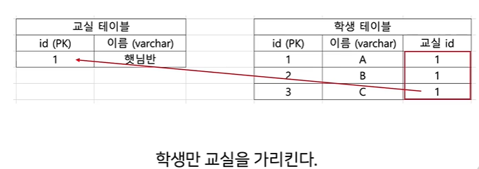

# JPA(Java Persistence API) 사용
- JPA란?  
객체와 관계형 DB의 테이블을 짝지어  
데이터를 영구적으로 저장할 수 있도록 정해진 JAVA진영의 '규칙'
- Hibernate란 ?
JPA는 규칙이고, 이 규칙을 코드로 작성한것이 바로 Hibernate이다.

## SQL을 직접 작성하면 아쉬운점
1. 문자열을 작성하기 때문에 실수를 할수있고, 실수를 인지하는 시점이 느리다.
2. 컴파일 시점에 에러를 발견 가능한게 아닌  
런타임 시점, 즉! 해당 코드가 실행될때 발견된다.
3. 특정 데이터베이스에 종속적이게 된다.
4. 반복작업이 많아진다.(CRUD 쿼리 항상 필요)
5. 데이터베이스의 테이블과 객체는 패러다임이 다르다.

### 객체

### 테이블
